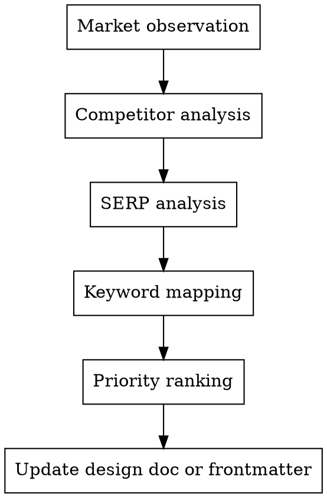

# 關鍵字研究

針對 HoMuChen 部落格的關鍵字研究流程。透過市場觀察、SERP 分析、競品研究來找出關鍵字機會、評估競爭程度、決定內容優先順序。

## When to Use

- 撰寫任何文章之前
- 規劃內容系列時
- 使用者要求關鍵字研究或 SEO 分析
- 更新既有內容計畫的關鍵字資料

## Process



---

### 1. 市場觀察

用 WebSearch 搜尋目標關鍵字，評估繁體中文市場現況：

- 繁體中文有多少篇優質文章？
- 結果主要是英文、簡體中文、還是繁體中文？
- 是大型媒體/企業站，還是個人部落格？
- 搜尋需求有沒有被滿足？哪裡有內容缺口？

同時搜尋相關產業數據和趨勢（Gartner、IDC 等），作為文章引用素材。

### 2. 競品分析

針對每個主要關鍵字群，找出誰在寫：

```markdown
- [站名](URL) — 內容描述（格式：單篇/系列/新聞）
```

觀察重點：
- 排名前幾的是誰？個人 vs 企業 vs 媒體？
- 內容品質如何？深度、時效性、完整度？
- 有沒有系列化教學？還是只有單篇？

### 3. SERP 分析

對每個目標關鍵字，觀察搜尋結果頁來評估競爭程度：

| 訊號 | 低競爭 | 高競爭 |
|------|--------|--------|
| 誰在排名？ | 個人部落格、Medium | 維基百科、大企業官網 |
| 內容品質 | 淺薄、過時 | 深入、完整 |
| 繁中結果數 | 0-2 篇 | 5+ 篇優質文章 |
| 內容形式 | 只有新聞/公告 | 完整教學/系列 |

**競爭程度定義：**

| 等級 | 判斷標準 |
|------|----------|
| 極低 | 繁中幾乎無相關內容 |
| 低 | 1-2 篇繁中文章，多數淺薄 |
| 中 | 有數篇文章但角度不同或品質參差 |
| 高 | 多篇優質繁中文章已在排名 |

**限制說明：** 競爭程度是基於 SERP 觀察的質性判斷，非來自 Ahrefs/SEMrush 的量化數據。如有工具存取權限，應以實際 Keyword Difficulty 數據校正。

### 4. 關鍵字映射

為每篇文章建立關鍵字表：

```markdown
| 類型 | 關鍵字 |
|------|--------|
| 主要關鍵字 | 要排名的核心搜尋詞 |
| 次要關鍵字 | 2-3 個相關詞 |
| 長尾關鍵字 | 3-4 個更具體、競爭較低的詞組 |
| 搜尋意圖 | Informational / Commercial / Transactional |
| 買家階段 | Awareness / Consideration / Implementation |
| 競爭程度 | 極低 / 低 / 中 / 高 |
| SEO 筆記 | 差異化機會、內容缺口、特殊觀察 |
```

**搜尋意圖分類：**
- **Informational** — 想了解某個概念（「AI Agent 是什麼」）
- **Commercial** — 在評估比較（「AI 寫作工具推薦」）
- **Transactional** — 想馬上行動（「Claude Skill 教學」）

**買家階段分類：**
- **Awareness** — 剛認識這個主題
- **Consideration** — 在考慮要不要用
- **Implementation** — 準備動手做

### 5. SEO 優先級排序

綜合三個因素排序：

1. **搜尋潛力** — 這個關鍵字有沒有需求？
2. **競爭程度** — 我們能排上去嗎？
3. **內容獨特性** — 我們有差異化的角度嗎？

輸出排序表：

```markdown
| 優先級 | 文章 | 理由 |
|--------|------|------|
| 最高 | ... | ... |
| 高 | ... | ... |
| 中 | ... | ... |
| 一般 | ... | ... |
```

---

## Output

- **系列文章**：將關鍵字研究加到 `docs/plans/` 的設計文件中
- **單篇文章**：將主要關鍵字、次要關鍵字記錄在草稿的規劃筆記或 frontmatter description 中

## Common Mistakes

- 跳過繁體中文市場檢查（英文競爭程度 ≠ 中文競爭程度）
- 沒有實際看搜尋結果就假設競爭程度
- 只打高搜尋量關鍵字（長尾關鍵字轉換率往往更高）
- 忽略搜尋意圖（寫了 Informational 內容去打 Transactional 查詢）
- 忘記記錄 SEO 筆記中的差異化機會
